# mkdocs how-tos

## installing mkdocs

on Dell pc, where python was installed by itself, and available from a general command prompt, just installed it with `pip install mkdocs` 

on Lenovo, where python was installed via anaconda, and available only from an anaconda prompt,  used an anaconda prompt (base environment) and the command (taken from https://anaconda.org/conda-forge/mkdocs):

```
conda install -c conda-forge mkdocs
```

It gave me the usual info about what was going to happen, and I told it to proceed: 
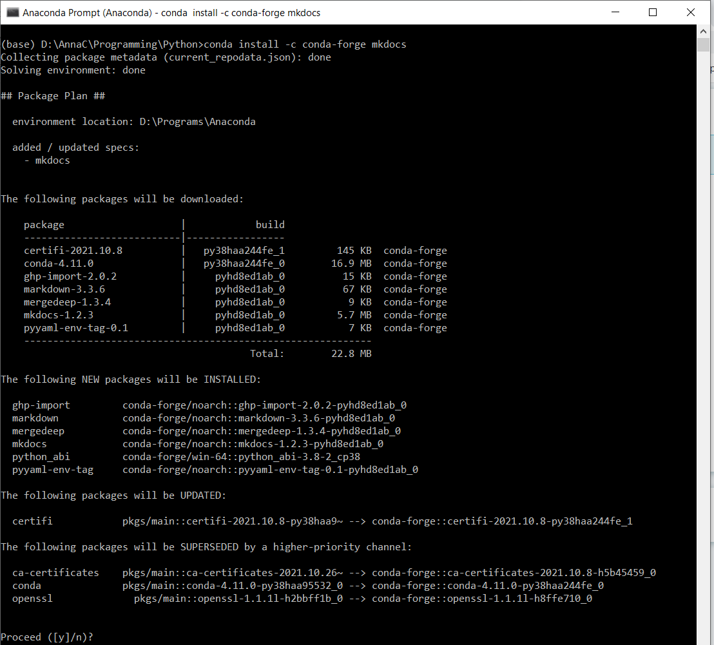

one that was done, I could see with `mkdocs --version` that it had been installed:

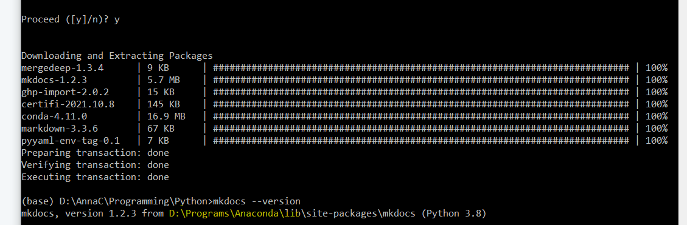

## creating a mkdocs project

next (always in the anaconda prompt) I cd'ed into the folder under which I want to create my mkdocs project, which is called docs_as_code:

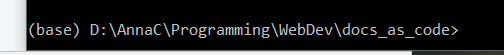

now with `mkdocs new setup-notes` I can create my project:
(nb if I am already in my desired project folder I can also use `mkdocs new .`
this will create the yml file directly inside the current folder and the docs folder underneath it)

This creates a folder called `setup-notes` with directly inside it the yml configuration file and the docs folder where all the markdown source files will go.

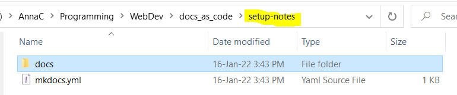 

Now, if I cd into the setup-notes folder, I can issue the `mkdocs serve` command (nb in this example all is being done in an anaconda prompt, but if python and mkdocs were installed differently it would be done under a regular command prompt):

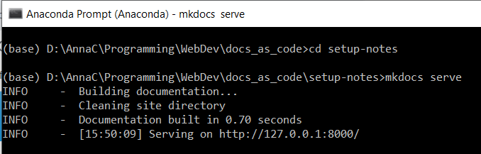

and opening up that url will show a preview of what the site would look like (for now just with the contents of the default **index.md** file located under **docs**).

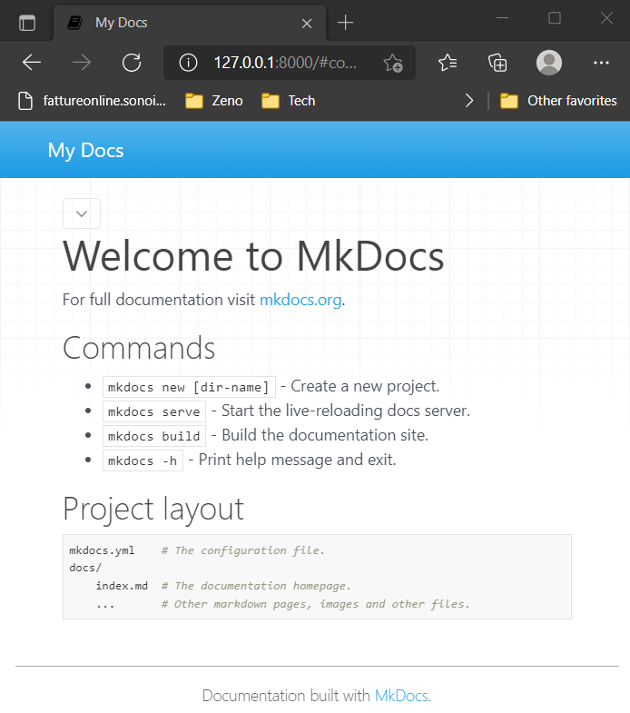

## yaml config file settings (initial ones)

by default the mkdocs.yml file contains only the mandatory site_ _name setting: 
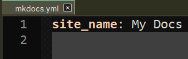

use of the config file is documented fully at https://www.mkdocs.org/user-guide/configuration/ 

however there are  a few settings it is important to configure for my particular setup:

- **use_directory_urls** should be set to *false*: the default true setting does not play well with image paths in markdown notes 
- the theme should be changed to *readthedocs* (rather than the default mkdocs)

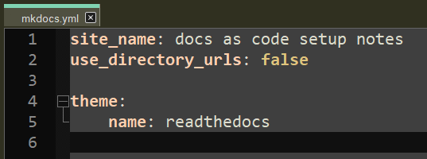

The reason is that readthedocs has a nice navigation pane on the left.

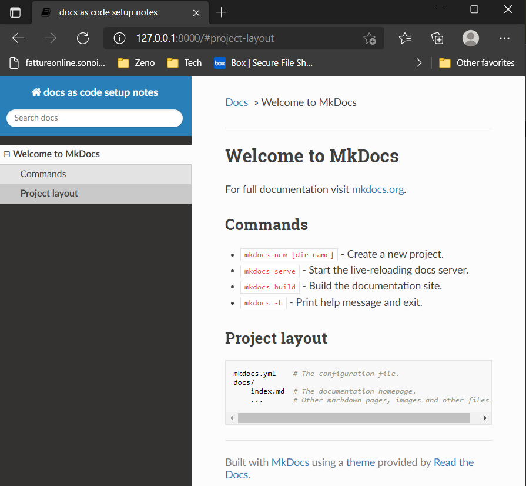

## adding content subfolders to the project

at present the only content my new project has in its docs folder is the default index.md file. But for example I could copy the folder of these how-to notes into the docs folder of the empty project, to obtain the following result: 

 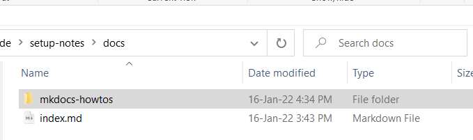

now, in addition to the index.md file, the docs folder contains a subfolder, which in its turn contains a markdown file and some image files (these notes).

Now, when I do `mkdocs serve` the navigation pane shows me not just "Welcome to MkDocs" (the default index.md file) but also the mkdocs how-tos. This is the result you get without any `nav` settings in the `yaml`  config file, just with autodiscovery of all the .md files in the docs tree. The all caps MKDOCS HOWTOS is not clickable, it  just corresponds to the subfolder. The lowercase **mkdocs how-tos** corresponds to the actual .md file in the folder.  

In any case, you can control what appears in the left-hand menu with the nav settings, this is just to show what happens automatically. In summary:

- each subfolder under docs turns into an all-caps, unclickable heading in the navigation pane. 
- each markdown file appears in the navigation pane grouped under its appropriate subfolder heading, and with a clickable hierarchical structure that corresponds to the level 1 (#) heading on top (not the md filename) and the lower level headings (##, ### etc) under it.

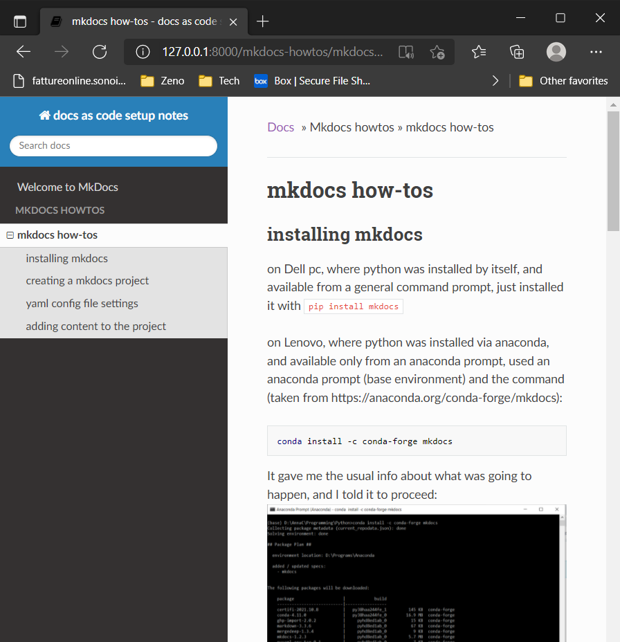

## improving the navigation pane

### set collapse_navigation to false

Notice how, by default, you can only see the inner structure of the currently selected item in the navigation pane: 
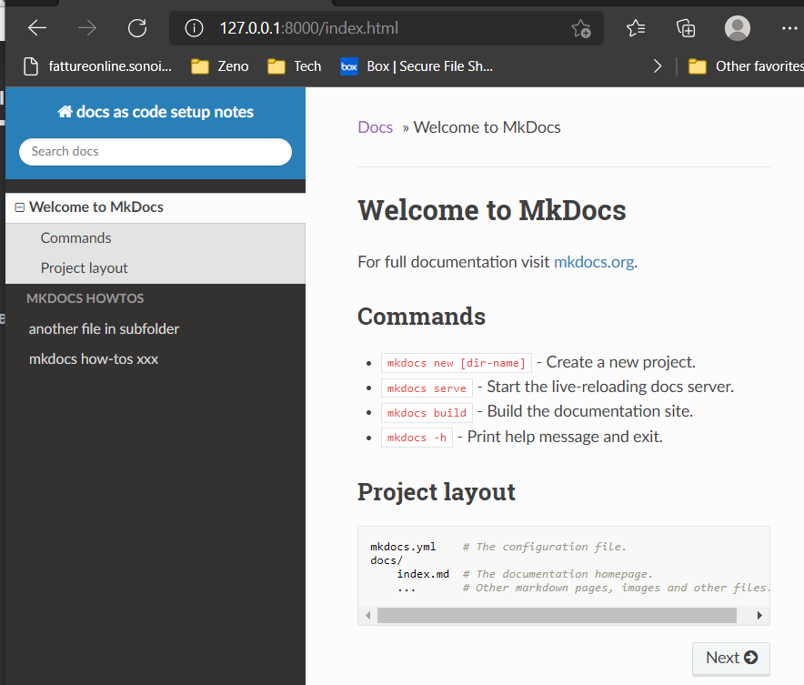

You can change this behavior by setting **collapse_navigation** to **False**. (nb this is a subsetting for the theme, not a top-level setting like site_name): 

```yaml
site_name: docs as code setup notes
use_directory_urls: false

theme: 
    name: readthedocs
    collapse_navigation: false
```

With collapse navigation set to false, you can expand the internal subheadings of any file in the navigation bar, not just the currently selected one: 

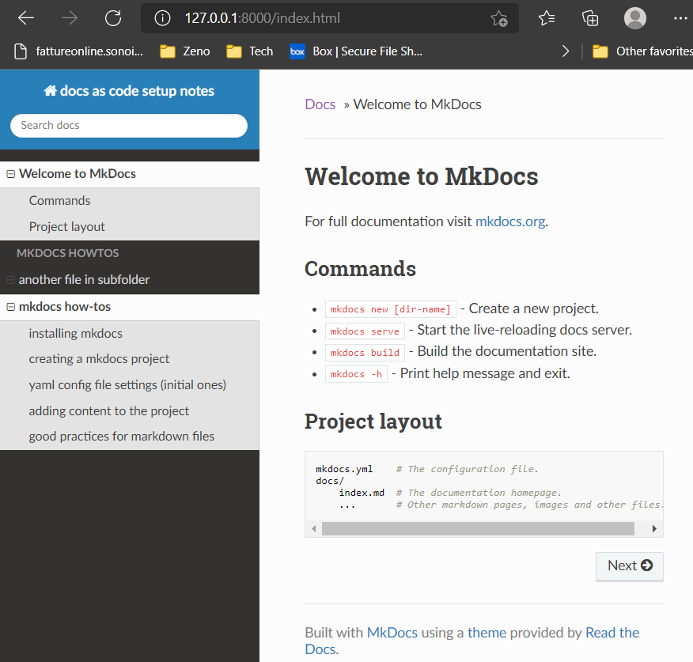

### add custom css

a confusing aspect of this navigation pane is that the items representing the markdown files are not indented relative to the upper-case heading that represents the containing folder .

To fix this, we can add a **css** subfolder to the **docs** folder that contains a file **extra.css** where we tweak the style as follows: 

```css
/* custom css for readthedocs theme navigation sidebar */
.caption {
    color:orange;
    margin-left: -10px;
}
```

  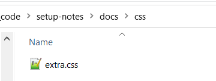

And in the yaml file we have to specify that this extra.css exists with:

```yaml
extra_css:
	- css/extra.css
```

this lets us achieve a little indent, so the text of the folder name (now orange) is now a little to the left of the text of the markdown files.

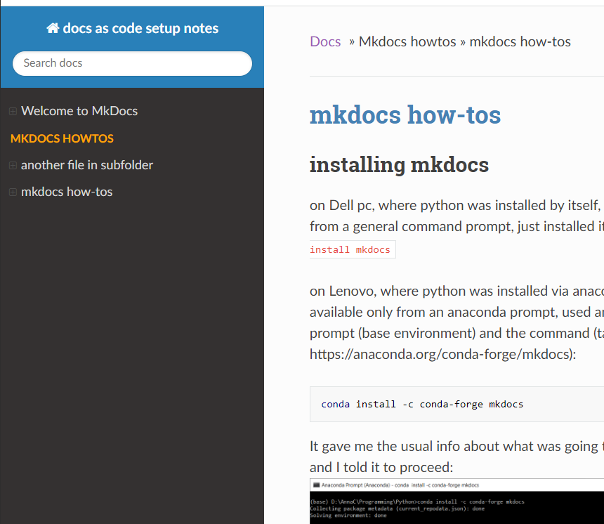

## building the site

so far we have only looked at a preview with the `mkdocs  serve` command.

we can now use `mkdocs build` to create the actual html static site. As a result of this command we get a **site** folder added to our project folder: 

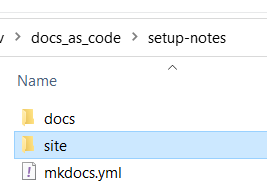  

The folder structure of docs is retained, except that every markdown file now corresponds to an html file (with the same name):

## deploying to github

### create the empty repo on github

for this purpose, I created a repository on github called docs-as-code (note, with the dashes rather than the underscores) 

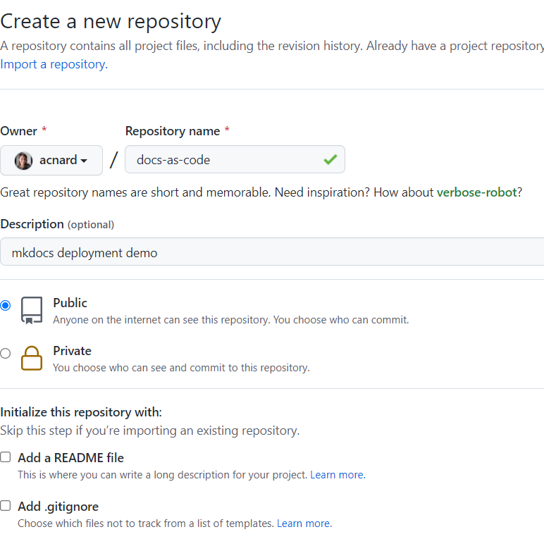

I just added a readme file, but apart from that the new repo on github is empty

### clone the new repo to local machine

on my local machine, I open up a command prompt (regular, not anaconda, since this is for git) in the WebDev folder, where I want to clone the new docs-as-code repo.

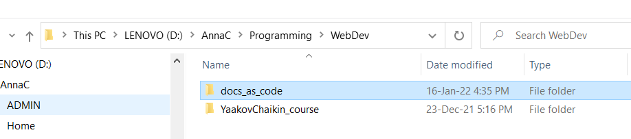

```
git clone https://github.com/acnard/docs-as-code.git
```

 as a result of this the remote is now cloned here: 
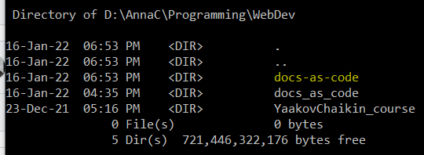

if I cd into this folder and do `git status` I get:

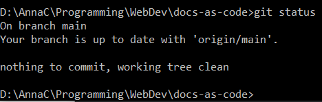

### gitignore the site folder

I am going to copy into here the entire mkdocs project I created earlier, but I do not want to source-control anything in the site folder, which is just generated by the mkdocs build process.

at the top-level (same as the README.md file) I have to create a file called .gitignore with the contents:

```
site/
```

### copy the yml config file and docs folder structure in

now I can copy in my mkdocs project basically (for now I will not copy in the sites folder)

## appendix - good practices for markdown files

There should be only one top-level heading (#) in each markdown file

 

