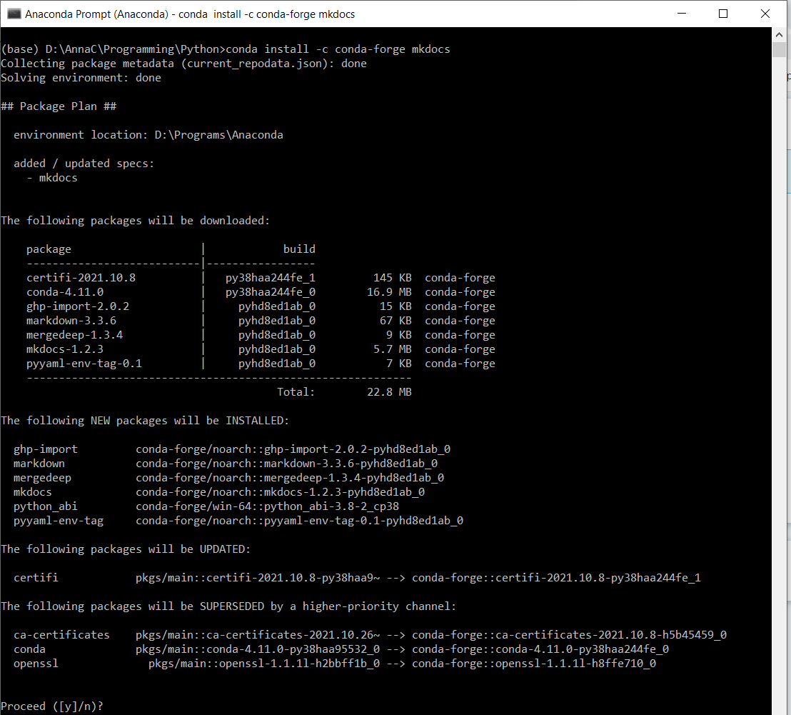
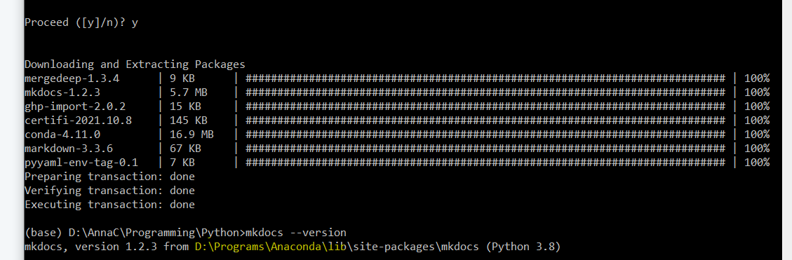
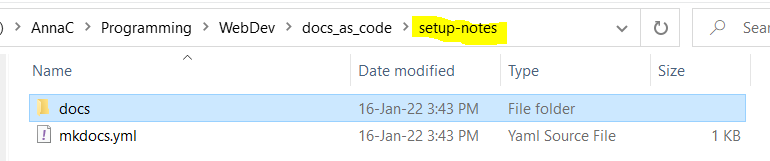
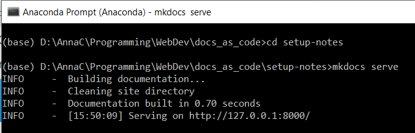
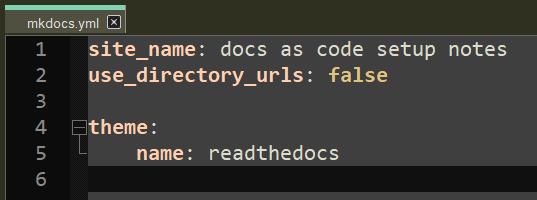
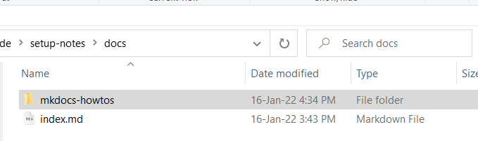
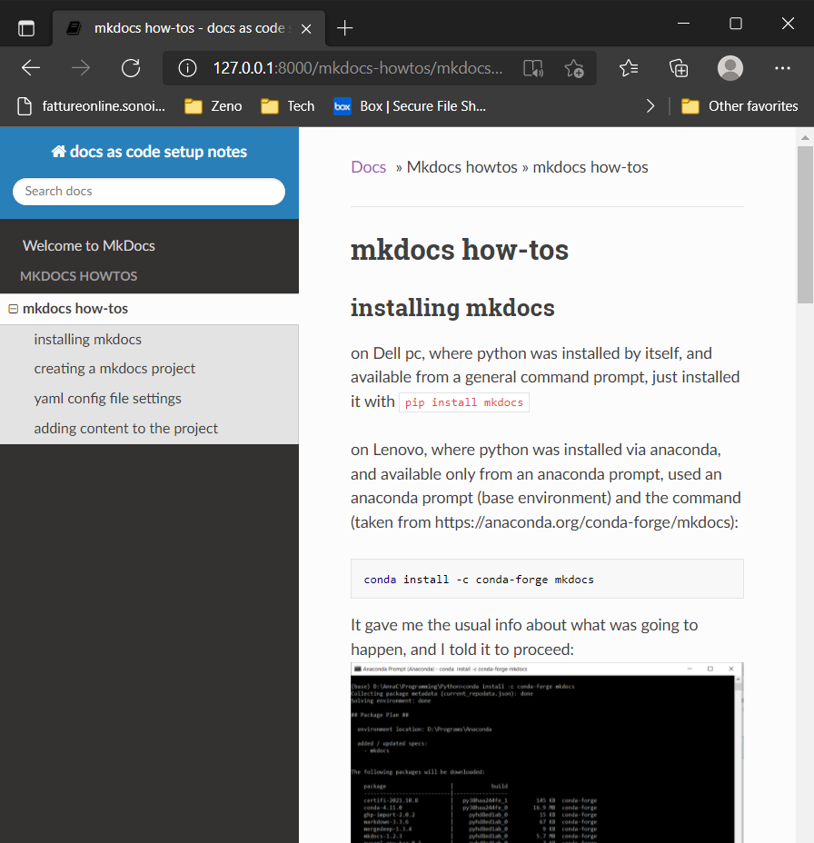
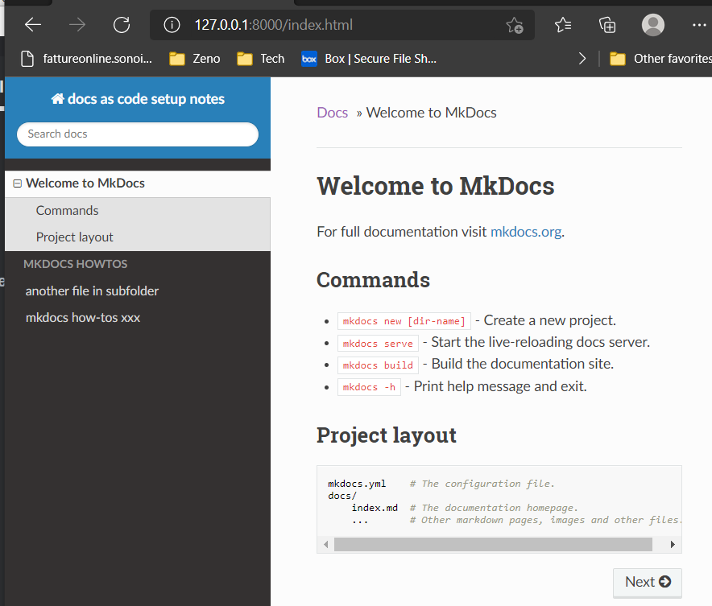
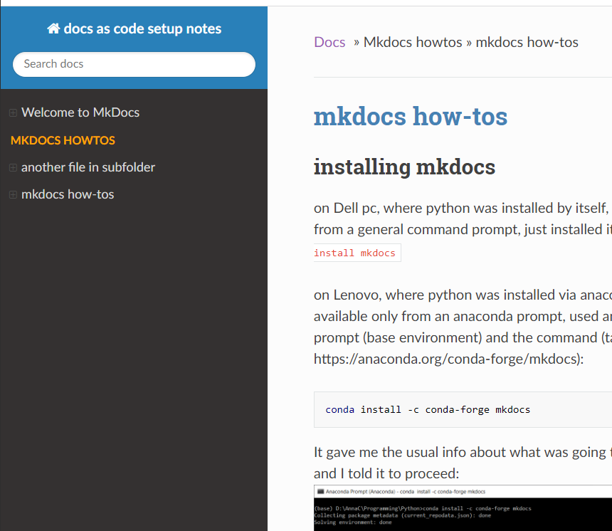
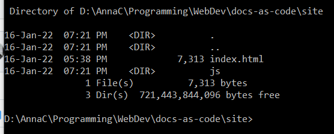

# mkdocs how-tos

## installing mkdocs

on Dell pc, where python was installed by itself, and available from a general command prompt, just installed it with `pip install mkdocs` 

on Lenovo, where python was installed via anaconda, and available only from an anaconda prompt,  used an anaconda prompt (base environment) and the command (taken from https://anaconda.org/conda-forge/mkdocs):

```
conda install -c conda-forge mkdocs
```

It gave me the usual info about what was going to happen, and I told it to proceed: 


one that was done, I could see with `mkdocs --version` that it had been installed:



## creating a mkdocs project

next (always in the anaconda prompt) I cd'ed into the folder under which I want to create my mkdocs project, which is called docs_as_code:


now with `mkdocs new setup-notes` I can create my project:
(nb if I am already in my desired project folder I can also use `mkdocs new .`
this will create the yml file directly inside the current folder and the docs folder underneath it)

This creates a folder called `setup-notes` with directly inside it the yml configuration file and the docs folder where all the markdown source files will go.

 

Now, if I cd into the setup-notes folder, I can issue the `mkdocs serve` command (nb in this example all is being done in an anaconda prompt, but if python and mkdocs were installed differently it would be done under a regular command prompt):



and opening up that url will show a preview of what the site would look like (for now just with the contents of the default **index.md** file located under **docs**).


## yaml config file settings (initial ones)

by default the mkdocs.yml file contains only the mandatory site_ _name setting: 


use of the config file is documented fully at https://www.mkdocs.org/user-guide/configuration/ 

however there are  a few settings it is important to configure for my particular setup:

- **use_directory_urls** should be set to *false*: the default true setting does not play well with image paths in markdown notes 
- the theme should be changed to *readthedocs* (rather than the default mkdocs)



The reason is that readthedocs has a nice navigation pane on the left.


## adding content subfolders to the project

at present the only content my new project has in its docs folder is the default index.md file. But for example I could copy the folder of these how-to notes into the docs folder of the empty project, to obtain the following result: 

 

now, in addition to the index.md file, the docs folder contains a subfolder, which in its turn contains a markdown file and some image files (these notes).

Now, when I do `mkdocs serve` the navigation pane shows me not just "Welcome to MkDocs" (the default index.md file) but also the mkdocs how-tos. This is the result you get without any `nav` settings in the `yaml`  config file, just with autodiscovery of all the .md files in the docs tree. The all caps MKDOCS HOWTOS is not clickable, it  just corresponds to the subfolder. The lowercase **mkdocs how-tos** corresponds to the actual .md file in the folder.  

In any case, you can control what appears in the left-hand menu with the nav settings, this is just to show what happens automatically. In summary:

- each subfolder under docs turns into an all-caps, unclickable heading in the navigation pane. 
- each markdown file appears in the navigation pane grouped under its appropriate subfolder heading, and with a clickable hierarchical structure that corresponds to the level 1 (#) heading on top (not the md filename) and the lower level headings (##, ### etc) under it.



## improving the navigation pane

### set collapse_navigation to false

Notice how, by default, you can only see the inner structure of the currently selected item in the navigation pane: 


You can change this behavior by setting **collapse_navigation** to **False**. (nb this is a subsetting for the theme, not a top-level setting like site_name): 

```yaml
site_name: docs as code setup notes
use_directory_urls: false

theme: 
    name: readthedocs
    collapse_navigation: false
```

With collapse navigation set to false, you can expand the internal subheadings of any file in the navigation bar, not just the currently selected one: 


### add custom css

a confusing aspect of this navigation pane is that the items representing the markdown files are not indented relative to the upper-case heading that represents the containing folder .

To fix this, we can add a **css** subfolder to the **docs** folder that contains a file **extra.css** where we tweak the style as follows: 

```css
/* custom css for readthedocs theme navigation sidebar */
.caption {
    color:orange;
    margin-left: -10px;
}
```

  

And in the yaml file we have to specify that this extra.css exists with:

```yaml
extra_css:
	- css/extra.css
```

this lets us achieve a little indent, so the text of the folder name (now orange) is now a little to the left of the text of the markdown files.



## building the site

so far we have only looked at a preview with the `mkdocs  serve` command.

we can now use `mkdocs build` to create the actual html static site. As a result of this command we get a **site** folder added to our project folder: 

  

The folder structure of docs is retained, except that every markdown file now corresponds to an html file (with the same name):

## initial deployment to github

### create the empty repo on github

for this purpose, I created a repository on github called docs-as-code (note, with the dashes rather than the underscores) 


I just added a readme file, but apart from that the new repo on github is empty

### clone the new repo to local machine

on my local machine, I open up a command prompt (regular, not anaconda, since this is for git) in the WebDev folder, where I want to clone the new docs-as-code repo.


```
git clone https://github.com/acnard/docs-as-code.git
```

 as a result of this the remote is now cloned here: 


if I cd into this folder and do `git status` I get:


### gitignore the site folder

I am going to copy into here the entire mkdocs project I created earlier, but I do not want to source-control anything in the site folder, which is just generated by the mkdocs build process.

at the top-level (same as the README.md file) I have to create a file called .gitignore with the contents:

```
site/
```

### add the yml config file and docs folder structure to the repo

now I can copy in my mkdocs project basically (for now I will not copy in the sites folder). So now it looks like this (with the files copied in from the mkdoc project highlighted in yellow):


if I do a `git status` it tells me that the files I've copied in are untracked: 


These are all things I want to track so I can do:

```
git add -A
```

Then if I do another 

```
git status
```

it shows me that all the new stuff needs to be committed


Now I can do a 

```
git commit
git push
```

 to get all this up onto github


### check that site folder is properly ignored

for test purposes, let's create a **site** subfolder and put some files and subfolders in it: 

 

and see what happens on `git status`:

in fact it does not tell me about these new untracked files (because they are not meant to be tracked)



to check which files are being ignored we can try the command:

```
git status --ignored --untracked-files=all
```

and it does indeed say it's ignoring all the files in site (and in its subdirectories):


### deploy to github pages with gh-deploy

now we are ready to try the command that builds the static site with mkdocs and deploys it automaticlally to github pages...

```
mkdocs  gh-deploy
```


... and there it is!


IMPORTANT NOTE: to get this to work, you should initially leave github pages *disabled*, as below. Enabling github pages from the repo settings is  only if you are using github's own jekyll site generator (and you would typically choose `main` as the source in this case)


Once you run `mkdocs gh-deploy`, what happens is that it creates the `gh-pages` branch automatically and also tells  github that you do *not* want to use the jekyll site generator. You end up with a situation like this:

  

### automatically update the deployed site on commits or merge to main

Now you can make changes to the documentation, however to make those changes visible in the deployed site,  you still need to re-run the  `mkdocs  gh-deploy` command. This article explains how to set up a github Action to do this automatically:

 https://datamattsson.tumblr.com/post/612351271067893760/the-perfect-documentation-storm

## operational workflow

once everything is set up,  the workflow for updating the documentation in this repo is as follows:

- The source files for the documentation are all located in the docs folder of the repo: 
  
- You can edit them (and commit changes) directly on github's web interface ,  
  
- Or you can clone the repo to a local machine and work on the content there with local tools (eg a markdown editor, etc) 
- In either case it is possible to use the usual git workflow (add, commit, push etcetera), with branching and merging as required.
- To make the changes visible in the deployed site you need to re-run the  `mkdocs  gh-deploy` command (not sure how to do this directly from github.. )

## appendix:

### good practices for markdown files

There should be only one top-level heading (#) in each markdown file

### summary of git workflow with branching

Note: do not work in the gh-pages branch. This is just for use by the site generator.

1. `git fetch` to check if there is anything updated on origin (if there is nothing, the command gives no output).
2. `git pull` to retrieve changes from origin (remote repository) 
3. when you start working on a feature, do `git branch branchname`  to create a branch and then `git checkout branchname` to switch to that branch.
   - You can do `git branch` to see a list of all the branches, the current one will have a star next to it.
4. Start making your changes on the branch. 
   - At any time, you can switch back to the main branch with `git checkout main` and it will put your files back exactly as they were before you started making those changes.
   - Add and commit your changes to the branch as usual, with `git add -A` followed by `git commit`.
5. When the changes in the branch are done (and all committed), and you want to merge them into the main stream: 
   - first do `git checkout main` to return to the main branch
   - then do `git  merge branchname` : this will bring the changes you made on the branch into your main stream.
6. Do a `git push` to update the remote. Note that the remote will not know about the branch you created as this was created and merged on the local machine before doing any push. I suppose it would know about it if you did a push while the branch was still unmerged. (see below)

### what happens if you push a local branch before merging it

nb this was done in Gitlab, not Github, but it's the same thing

1. Locally I create a new branch for my feature/fix with `git branch <branchname>` and switch to it `git checkout <branchname>`. As always the `git branch` command shows me what branches I have, with an asterisk next to the one I'm currently on. 
   
2.  I make my changes (this involves adding and modifying some files)  in the file system, after which a git status tells me I have untracked changes.  So I do a `git add -A` followed by `git commit` to commit my changes to the new branch.
   
3.  At this point, my new branch is all committed but exists only on the local machine. The origin does not know anything about it. If I want to push the unmerged branch to the origin (so it'll be visible on gitlab) I do a `git push origin <branchname>`
   
4. When I do this then on gitlab I can see that there are now two branches, main and the new one I created. If I switch to the new one I can see all my changes, and if I switch to main I can see the files as they were before.
   
5. This shows that the new branch is now ahead of main
   
6. I can also do `git remote show origin ` to check the situation  

### use -u for pushing the branch, otherwise you can't pull

Problem with the above workflow is that, by pushing the new local branch to origin, it's as if I had cloned in the reverse direction. i.e. I won't be able to pull down changes from origin.  (The above screenshot  reveals this because it says only main is configured for git pull.) In fact, if I try to do a git pull from the branch it tells me :


You also need to set up the local branch to track the remote branch. An easy way to accomplish this is to use the -u option when you do the git push, i.e

 `git push -u origin <branchname>`  


Now having done that, a `git remote show origin` command now shows me that the new branch is now configured for git pull.


